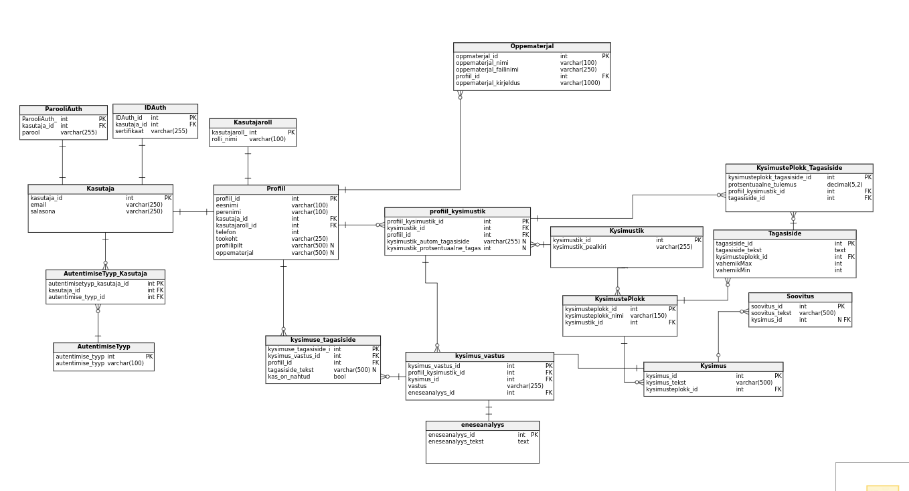

# Opetaja professionaalse arengu mudel (TLU Suveprakika projekt)

## Pildid rakendusest

## Mis on meie rakenduse eesm2rk?
* Lihtsustada 6petajate enesearendus protsessi
* Anda koolidele lihtsam viis 6pejajaid hinnata

## Projektist endast
Projekt on loodud TLU Digitehnoloogia Instituudi 6pilaste poolt ning loodi Tarkvaraarenduse projekti kursuse raames.
Projekti kavandamisega alustati 2021 kevadsemester ning koodi hakati kirjutama juunis 2021. 

## Kasutatud tehnoloogiad
* React
    * Pluginad client/package.json
* Node.js
    * Pluginad server/package.json failis
* Express
* MariaDB

## Loojad
* **Alex Nelke**
* **Caroly Vilo**
* **Martin Kilgi**
* **Mait Jurask**

## Paigaldusjuhised

### 1. Andmebaasi ylesseadmine

1. Installeerige andmebaas `sudo apt-get install mariadb-server`.
1. K2ivitage mysql: `sudo mysql -u root`.
1. Looge uus kasutaja ab's: `CREATE USER '"kasutajanimi"'@'localhost' IDENTIFIED BY '"parool"'` (asenda "" read oma andmetega).
1. Tekita uus andmebaas: `CREATE DATABASE ...;` ... ab nimi.
1. Anna uuele kasutajale oigused `GRANT ALL PRIVILEGES ON "andmebaasi nimi".* TO '"andmebaasi kasutaja"'@'localhost';` ("" asenda oma andmetega)
1. Mine kausta `/server` ning k2ivita skript 

### 2. Serveri ja kliendi k2ivitamine
1. Tommata alla repo k2suga: `git clone https://github.com/MaitJ/opetaja-prof-arengu-mudel.git`.
1. Navigeerida `/server` kausta ja sisestada k2sk `npm install`.
1. Installeerimise l6pus `node index.js`, et k2ivitada server.
1. Navigeerida `/client` kausta ja muuta failis `.env` rida `REACT_APP_SERVER_URL=...` ... asemele sisestage serveri ip aadress koos pordiga.
1. `/client` kaustas k2ivitada k2sk npm install.
1. Installeerimise l6pus saab k2ivitada kliendi k2suga `npm start`.

## Litsents
WIP
